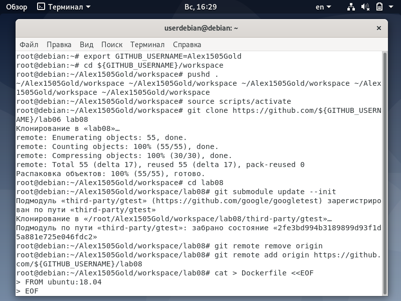
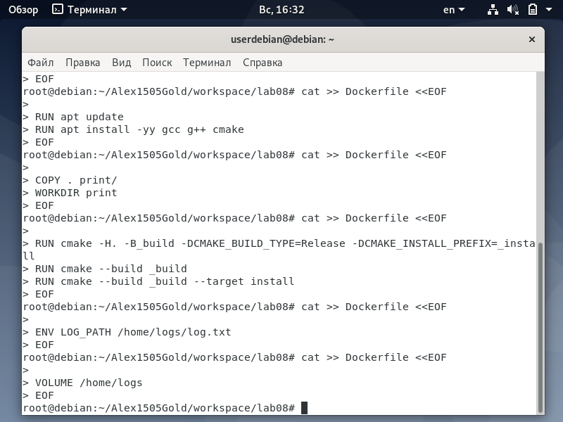
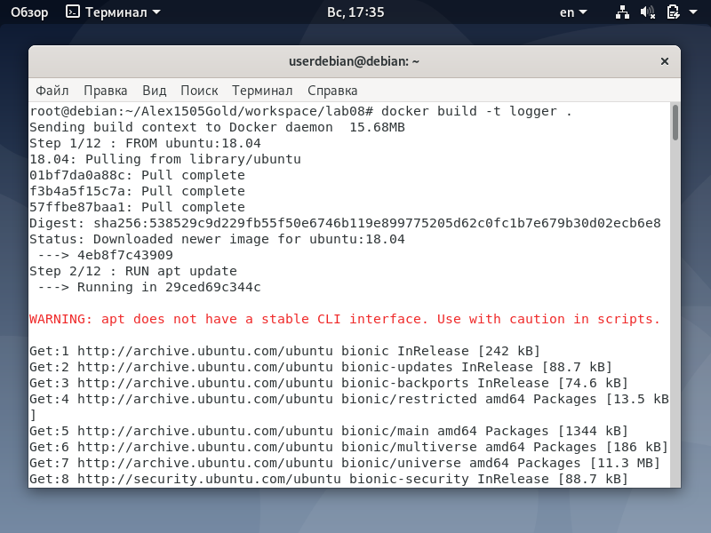
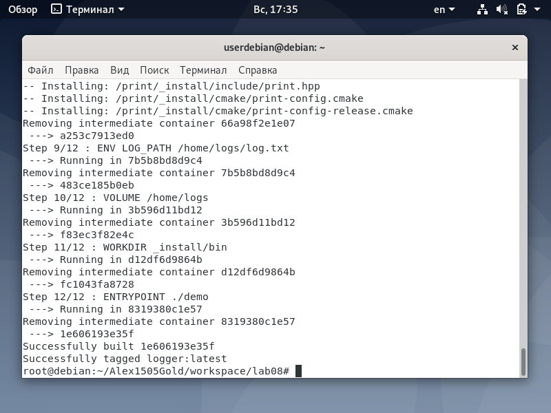
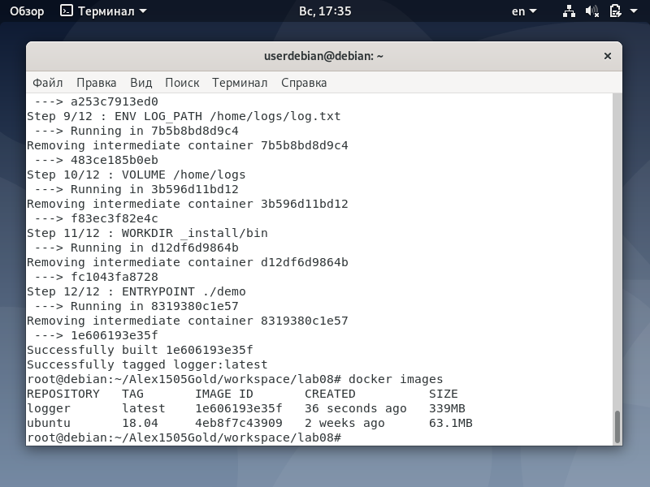
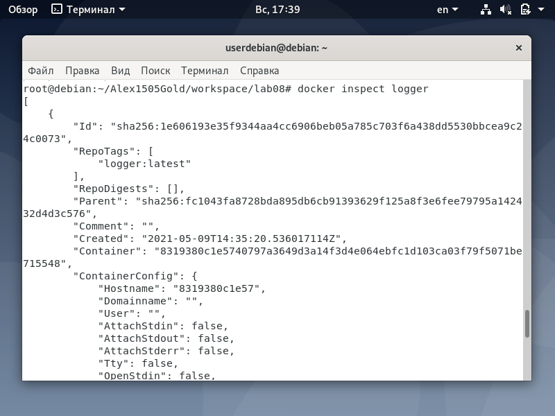

<h1>Отчет по лобораторной 08</h1>
</br>gmail почта - sgolenkov2002@gmail.com </br>
telegram - @Xacker_ducker

<h2>Ход выполнения лабораторной работы:</h2>

[репозиторий lab08](https://github.com/Alex1505Gold/lab08)</br>
Были выплнены следующие команды
```shell
export GITHUB_USERNAME=Alex1505Gold
cd ${GITHUB_USERNAME}/workspace
pushd .
source scripts/activate
git clone https://github.com/${GITHUB_USERNAME}/lab07 lab08
cd lab08
git submodule update --init
git remote remove origin
git remote add origin https://github.com/${GITHUB_USERNAME}/lab08
cat > Dockerfile <<EOF
FROM ubuntu:18.04
EOF
cat >> Dockerfile <<EOF

RUN apt update
RUN apt install -yy gcc g++ cmake
EOF
cat >> Dockerfile <<EOF

COPY . print/
WORKDIR print
EOF
cat >> Dockerfile <<EOF

RUN cmake -H. -B_build -DCMAKE_BUILD_TYPE=Release -DCMAKE_INSTALL_PREFIX=_install
RUN cmake --build _build
RUN cmake --build _build --target install
EOF
cat >> Dockerfile <<EOF

ENV LOG_PATH /home/logs/log.txt
EOF
cat >> Dockerfile <<EOF

VOLUME /home/logs
EOF
cat >> Dockerfile <<EOF

WORKDIR _install/bin
EOF
cat >> Dockerfile <<EOF

ENTRYPOINT ./demo
EOF
```
Для установки docker были выполнены следующие действия
```shell
sudo apt update
sudo apt install apt-transport-https ca-certificates curl gnupg2 software-properties-common
curl -fsSL https://download.docker.com/linux/debian/gpg | sudo apt-key add -
sudo add-apt-repository "deb [arch=amd64] https://download.docker.com/linux/debian $(lsb_release -cs) stable"
sudo apt update
apt-cache policy docker-ce
sudo apt install docker-ce
sudo systemctl status docker
```

```shell
docker build -t logger .
docker images
mkdir logs
docker run -it -v "$(pwd)/logs/:/home/logs/" logger
docker inspect logger
cat logs/log.txt
gsed -i 's/lab07/lab08/g' README.md
vim .travis.yml
/lang<CR>o
services:
- docker<ESC>
jVGdo
script:
- docker build -t logger .<ESC>
:wq
git add Dockerfile
git add .travis.yml
git commit -m"adding Dockerfile"
git push origin master
travis login --auto
travis enable
```
Результаты выполнения команд
</br>
</br>
</br>
</br>
</br>
</br>
